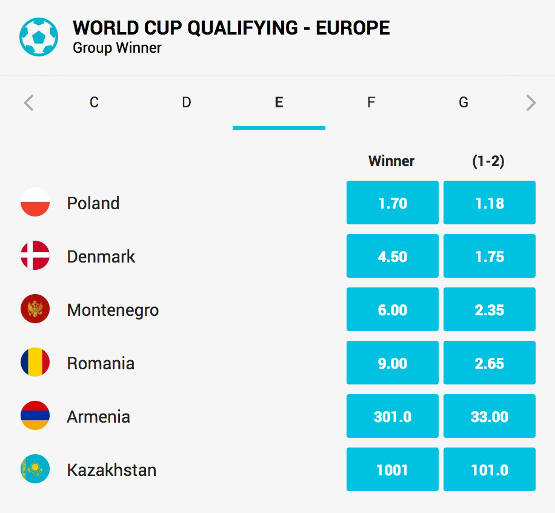

# group-winner-widget



Overview of competition's group phase. Contains participants list for each group on separate tabs and allows to bet on the group winner. Widget won't show if there is no supported filter found in current highlights.

## Configuration example:

Arguments and default values:

```json
...
{
   "args": {
      "filter": null,
      "title": null,
      "tagline": null,
      "criterionId": null,
      "skipHighlightsCheck": false,
      "pollingInterval": 30000,
      "widgetTrackingName": "gm-group-winner-widget"
   }
},
...

```

### The widget accepts the following arguments:

1.  `filter` - string - competition filter. If set it will override default behaviour and force given filter to be used.
2. `title` - string - widget's title which will be figured out if not provided
3. `tagline` - string - widget's tag line which will be figured out if not provided
4. `criterionId` - number - bet offers criterion identifier
5. `skipHighlightsCheck` - boolean - doesn't check for filter existence in highlights (good for development)
8. `flagUrl` - string - base URL of directory which should contain necessary flags
9. `pollingInterval` - number - interval in milliseconds to get new live data for live matches
10. `widgetTrackingName` - string - tracking name for analytics purposes


### Build Instructions

Please refer to the [core-library](https://github.com/kambi-sportsbook-widgets/widget-core-library)
